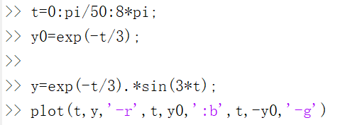

# MATLAB entry

## 符号与函数

**π**：pi

## 结果

```matlab
ans =
```

画图

首先定义步长t；

plot(步长t,函数y,颜色（’-r、g、b、‘）)



## 矩阵

### 定义

```matlab
A=[1,2,3;4,5,6;7,8,9]
```

## 定义之前先规定数据格式（format）

### 使用十进制表示法

```matlab
format short e

format short

format short g(默认)
```

## 清除变量

```matlab
clc
```

## 快捷键

上标：Ctrl+H
下标：Ctrl+L
上下标：Ctrl+J

小括号：Ctrl+9
中括号：Ctrl+[
大括号：Ctrl+Shift+[
