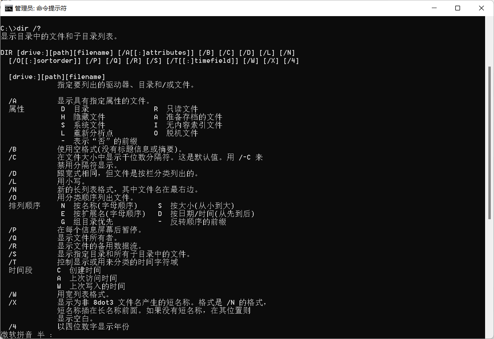

- 命令提示符
- 基本的磁盘操作系统
- 基本的输入输出系统

## DOS命令

- 内部命令
- 外部命令

### 分类

- .com 命令文件
- .exe 可执行文件
- .bat 批处理文件

### 流程

首先输入一个dos命令，如tree,dos会自动变为tree.com，

如果有就投入运行，否则找tree.com，找到就运行，

否则找tree.bat，找到后将其中的dos命令，逐个投入运行。


## 命令示例（常用）

任何命令之后都可加？,以查询用法如**dir /?**

### 常用内部命令

DATE  日期

TIME   时间

VER     系统版本

#### dir



1. 查看当前目录是有什么内容 dir

   文件夹本身也占字节数

  ```
  dir dir d:\abc2\test200
  ```

#### cd

Change directory——改变文件夹
.  是原处

.. 父亲


2. 切换到其他盘下：盘符号 cd :

  ```
   change directory
  ```

  案例演示：切换到 c 盘 

  ```
  cd /D c:
  ```


3. 切换到当前盘的其他目录下 (使用相对路径和绝对路径演示), ..\表示上一级目录
    案例演示： 

  ```
  cd d:\abc2\test200 cd ..\..\abc2\test200
  ```


4. 切换到上一级：
    案例演示： cd .. 5) 切换到根目录：cd \
    案例演示：

  ```
  cd \
  ```

#### md 

Make directory——创建文件夹

#### rd   

Remove directory——删除文件夹

#### cls

清屏 

```
cls 
```

#### exit

退出 DOS

```
 exit
```

说明: 因为后面使用 DOS 非常少，所以对下面的几个指令,了解即可

  ```
   md[创建目录]
   rd[删除目录]
   copy[拷贝文件]
   del[删除文件]
   echo[输入内容到文件]
   type,move[剪切]) => Linux
  ```

### 常用外部命令

####   tree

```c
tree
```

### 