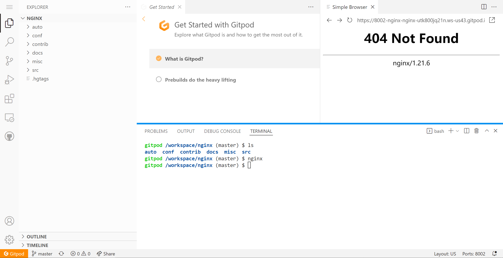

[5个隐藏的GitHub神技巧，助你秒变大佬！\_哔哩哔哩\_bilibili](https://www.bilibili.com/video/BV1q54y1f7h6?spm_id_from=333.337.search-card.all.click)

来自程序员鱼皮

笔记地址：[blog-mkdocs/Blog/github_note](https://bailh.github.io/blog-mkdocs/Blog/github_note/)

## 1.搜索

github高级搜索功能

直接打开这里[GitHub · Where software is built](https://github.com/search/advanced)

或搜索后在搜索页面 language 下方打开（没找到更好的方法）

更多技巧可查看官方文档：

[About searching on GitHub \- GitHub Docs](https://docs.github.com/cn/search-github/getting-started-with-searching-on-github/about-searching-on-github)

[搜索代码 \- GitHub Docs](https://docs.github.com/cn/search-github/searching-on-github/searching-code)

## 2.查找文件

在主页按“t”：查找文件

点进源代码后，按“l”：跳转到某一行

点击行号：

1. 复制这行代码
2. 生成永久链接

源代码中按“b”：查看文件的改动记录

键盘快捷键：

- 文档

  [键盘快捷键 \- GitHub Docs](https://docs.github.com/cn/get-started/using-github/keyboard-shortcuts)

- 图片

  [GitHub Markdown Cheat Sheet \(Example\)](https://coderwall.com/p/ln-ira/github-markdown-cheat-sheet)

## 3.阅读代码技巧

代码跳转：

1. 下载到本地
2. 在线vscode：仓库详情界面按下“。”键，

## 4.在线运行项目

在项目地址前加上`gitpod.io/#/`前缀

<https://github.com/nginx/nginx>  => <https://gitpod.io/#/github.com/nginx/nginx>

登陆：

加载：

运行：

## 5.项目推送

根据自己的喜好让github推送自己感兴趣的优质项目

获取邮件更新：

